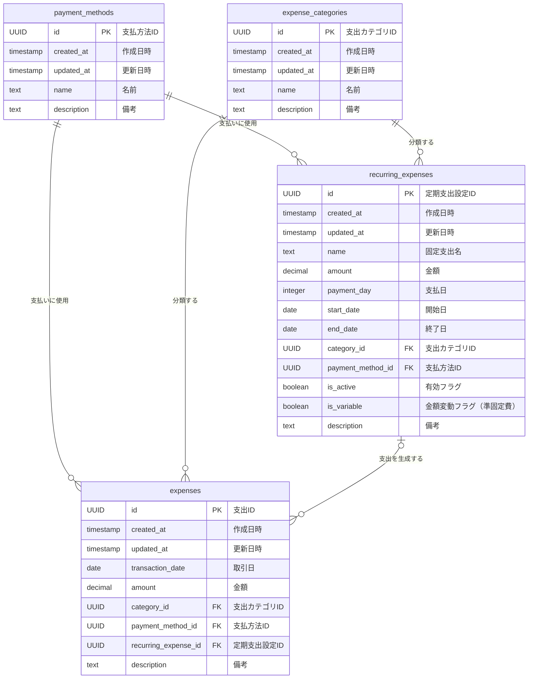
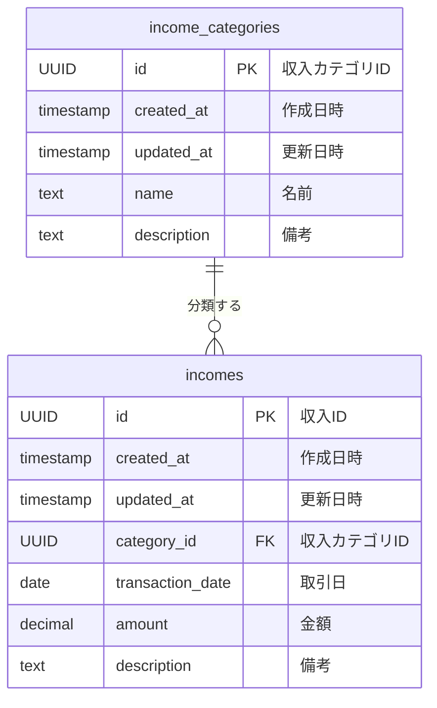

# DB定義メモ

## 支出関係

```mermaid
erDiagram
  %% 支出テーブル %%
  支出[expenses] {
      UUID id PK "支出ID"
      timestamp created_at "作成日時"
      timestamp updated_at "更新日時"
      date transaction_date "取引日"
      decimal amount "金額"
      UUID category_id FK "支出カテゴリID"
      UUID payment_method_id FK "支払方法ID"
      UUID recurring_expense_id FK "定期支出設定ID"
      text description "備考"
  }

  %% 支出カテゴリテーブル %%
  支出カテゴリ[expense_categories] {
      UUID id PK "支出カテゴリID"
      timestamp created_at "作成日時"
      timestamp updated_at "更新日時"
      text name "名前"
      text description "備考"
  }

  %% 定期支出設定テーブル %%
  定期支出設定[recurring_expenses] {
      UUID id PK "定期支出設定ID"
      timestamp created_at "作成日時"
      timestamp updated_at "更新日時"
      text name "固定支出名"
      decimal amount "金額"
      integer payment_day "支払日"
      date start_date "開始日"
      date end_date "終了日"
      UUID category_id FK "支出カテゴリID"
      UUID payment_method_id FK "支払方法ID"
      boolean is_active "有効フラグ"
      boolean is_variable "金額変動フラグ（準固定費）"
      text description "備考"
  }

  %% 支払方法テーブル %%
  支払方法[payment_methods] {
      UUID id PK "支払方法ID"
      timestamp created_at "作成日時"
      timestamp updated_at "更新日時"
      text name "名前"
      text description "備考"
  }

  支払方法 ||--o{ 支出 : "支払いに使用"
  支出カテゴリ ||--o{ 支出 : "分類する"

  支払方法 ||--o{ 定期支出設定 : "支払いに使用"
  支出カテゴリ ||--o{ 定期支出設定 : "分類する"

  定期支出設定 o|--o{ 支出 : "支出を生成する"
```

```mermaid
erDiagram
    %% 収入テーブル %%
    収入[incomes] {
        UUID id PK "収入ID"
        timestamp created_at "作成日時"
        timestamp updated_at "更新日時"
        UUID category_id FK "収入カテゴリID"
        date transaction_date "取引日"
        decimal amount "金額"
        text description "備考"
    }

    %% 収入カテゴリテーブル %%
    収入カテゴリ[income_categories] {
        UUID id PK "収入カテゴリID"
        timestamp created_at "作成日時"
        timestamp updated_at "更新日時"
        text name "名前"
        text description "備考"
    }

    収入カテゴリ ||--o{ 収入 : "分類する"
```
