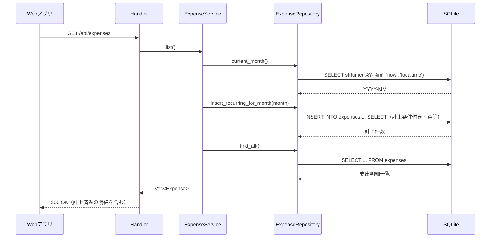
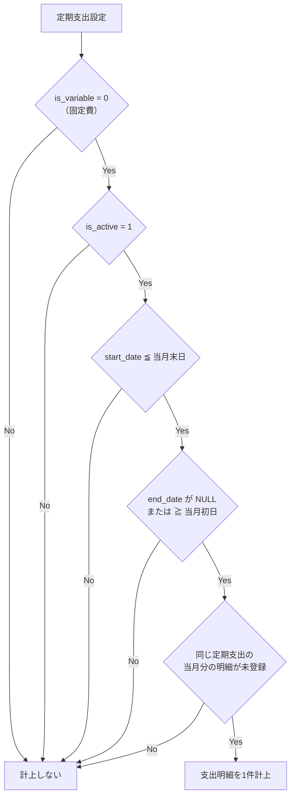
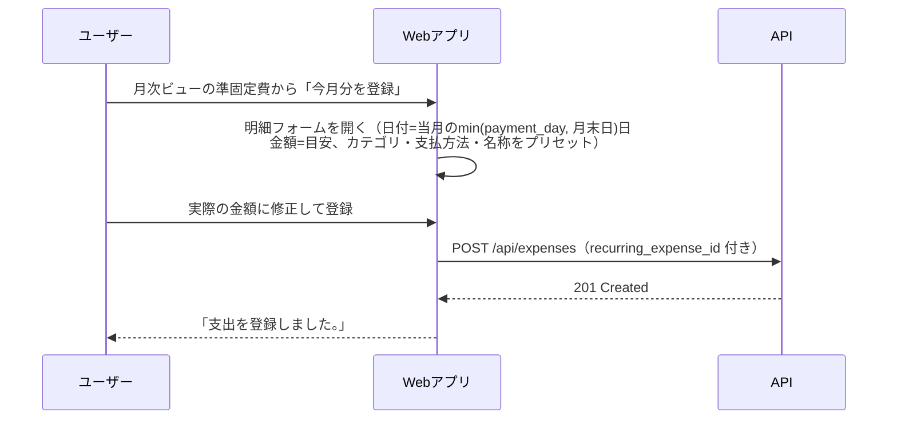

# 定期支出の自動計上

定期支出設定（固定費）から支出明細を自動生成する仕組みの設計をまとめる。

## 背景

定期支出設定は `recurring_expenses` テーブルに登録できるが、設定だけでは支出明細（`expenses`）が生成されず、月次・日別集計やCSVエクスポートに固定費が反映されなかった。

`expenses.recurring_expense_id` は設計上「定期支出設定から生成された明細」を紐付けるための外部キーとして用意されていたが、生成する仕組みが未実装だった。

## 方式

**支出一覧取得（`GET /api/expenses`）のタイミングで、当月分の明細を遅延生成（lazy generation）する。**

このアプリにはバッチ／cron のような定期実行基盤がなく、Web アプリは画面表示のたびに必ず `GET /api/expenses` を呼び出す。そのため一覧取得をフックにすれば、ユーザーは画面を開くだけで当月分の固定費が明細へ計上される。

### 却下した代替案

| 代替案 | 却下理由 |
| --- | --- |
| バッチ／cron で定期実行 | 実行基盤が存在しない |
| 専用エンドポイント＋画面の「計上」ボタン | 手動操作が必要になり、計上漏れが発生しうる |
| 一覧レスポンスで仮想的に合成（レコードを作らない） | 集計・CSVエクスポート・明細の編集／削除との整合が困難 |

## 処理の流れ

## 計上条件

定期支出設定のレコードごとに、以下のすべてを満たす場合のみ当月分の明細を1件生成する。

- 生成される明細の項目は定期支出設定から引き継ぐ（`amount` / `category_id` / `payment_method_id` / `description`）
- `recurring_expense_id` には定期支出設定のIDを設定し、変動費の集計から除外されるようにする
- `transaction_date` は当月の `min(payment_day, 月末日)` 日とする（月末丸め）

### 月末丸め

`payment_day` がその月の日数を超える場合は月末日に丸める。

| payment_day | 対象月 | transaction_date |
| --- | --- | --- |
| 15 | 2026-08 | 2026-08-15 |
| 31 | 2026-02（28日まで） | 2026-02-28 |

### 冪等性

`NOT EXISTS` により、同じ定期支出・同じ月の明細が既に存在する場合は挿入しない。一覧取得を何度呼んでも二重計上されず、翌月になると新たに1件計上される。

## 当月の判定基準

当月はアプリケーションの時計ではなく、SQLite が返すローカル時刻（`strftime('%Y-%m', 'now', 'localtime')`）を基準とする。生成対象の月は SQL のバインドパラメータ（`?1` = `YYYY-MM`）として渡すため、テストから任意の月を指定して計上ロジックを検証できる。

## 準固定費（金額が変動する定期支出）

電気代や水道代のように「毎月必ず支払が発生するが金額は月ごとに変動する」支出は、定期支出設定の `is_variable = 1` として登録する「準固定費」として扱う。

### 固定費との違い

| 項目 | 固定費（`is_variable = 0`） | 準固定費（`is_variable = 1`） |
| --- | --- | --- |
| 金額の意味 | 確定した毎月の支払額 | 目安の金額 |
| 支出明細への自動計上 | する（本ドキュメントの仕組み） | しない |
| 明細の登録方法 | 自動（一覧取得時の遅延生成） | 月次ビューの「今月分を登録」ボタンから金額を確定して登録 |

### 準固定費を自動計上しない理由

変動する金額を目安の金額で自動計上すると、編集し忘れた月が目安の金額のまま集計に混入し、不正確な家計簿になる。これを防ぐため、準固定費はユーザーが金額を確定してから明細を登録する運用とする。

### 「今月分を登録」の流れ

- フォームのタイトルは「準固定費を登録」となり、支出種別の切り替えは表示しない
- 登録された明細は `recurring_expense_id` で定期支出設定に紐付くため、変動費の集計には混入しない
- 同じ月に複数回登録することもできる（自動計上と異なり冪等性の制御は行わない）

## 実装箇所

| レイヤ | ファイル | 内容 |
| --- | --- | --- |
| SQL | `queries/expenses/current_month.sql` | 当月（`YYYY-MM`）の取得 |
| SQL | `queries/expenses/insert_recurring_for_month.sql` | 条件付き `INSERT ... SELECT` による計上（`is_variable = 0` のみ） |
| Repository | `src/repository/expenses.rs` | `current_month()` / `insert_recurring_for_month()` |
| Service | `src/service/expenses.rs` | `list()` の冒頭で当月分の計上を実行 |
| Web | `src/lib/features/forms/TransactionForm.svelte` | 準固定費プリセット（`initialRecurring`）による明細登録 |
| Web | `src/lib/features/monthly/MonthlySummary.svelte` | 固定費／準固定費の区分表示と「今月分を登録」ボタン |
| Web | `src/routes/+page.svelte` | 準固定費からの明細登録フォーム起動 |

## 制約・注意事項

- **計上は当月分のみ**。過去月は遡って生成しない（初回利用月以降が対象）
- **計上タイミングは支出一覧の取得時**。画面を開かない限り明細は生成されない
- **計上された明細を削除すると再計上される**。冪等性は「同月の明細の有無」だけを見ているため、明細を削除すると次回の一覧取得で再度生成される。当月分を計上したくない場合は、明細の削除ではなく定期支出設定を無効化（`is_active = 0`）または終了日を設定する
- **計上済みの明細がある定期支出設定は削除できない**。`expenses.recurring_expense_id` の外部キー制約による。先に明細側を削除する必要がある
- 計上された明細は通常の支出明細と同じく編集・削除・CSVエクスポートの対象になる

## テスト

`tests/expenses_api.rs` で以下を確認する。

- 一覧取得時に有効な定期支出が当月分として計上されること（無効な設定は対象外）
- 繰り返し呼び出しても二重計上されないこと（冪等性）
- `payment_day` が月末日を超える場合に月末日へ丸められること
- 開始前・終了済みの定期支出が計上されないこと
- 翌月に再度計上されること
- 準固定費（`is_variable = 1`）が計上されないこと
